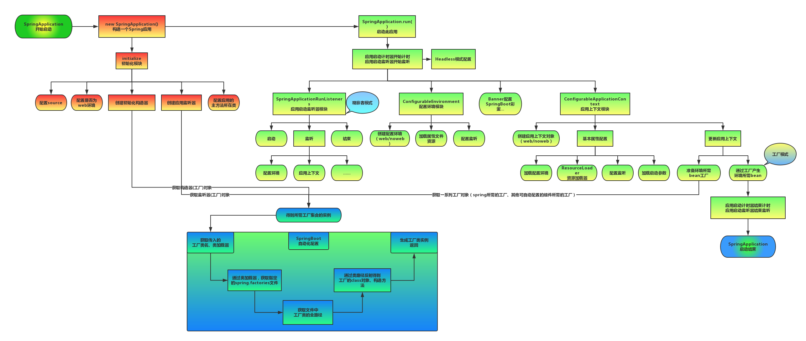
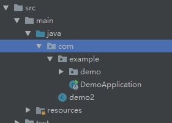
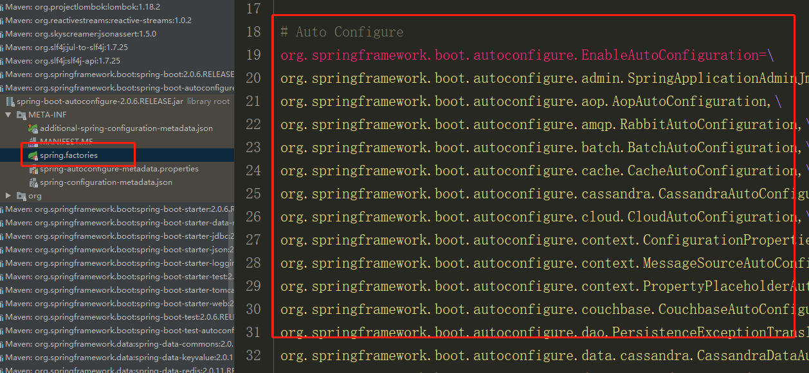
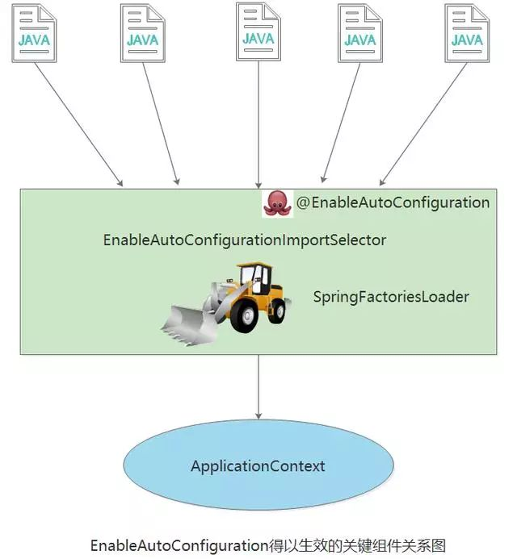
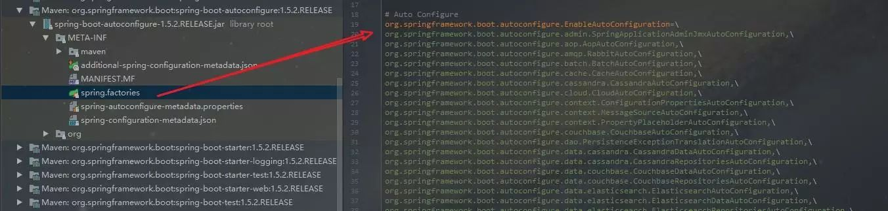
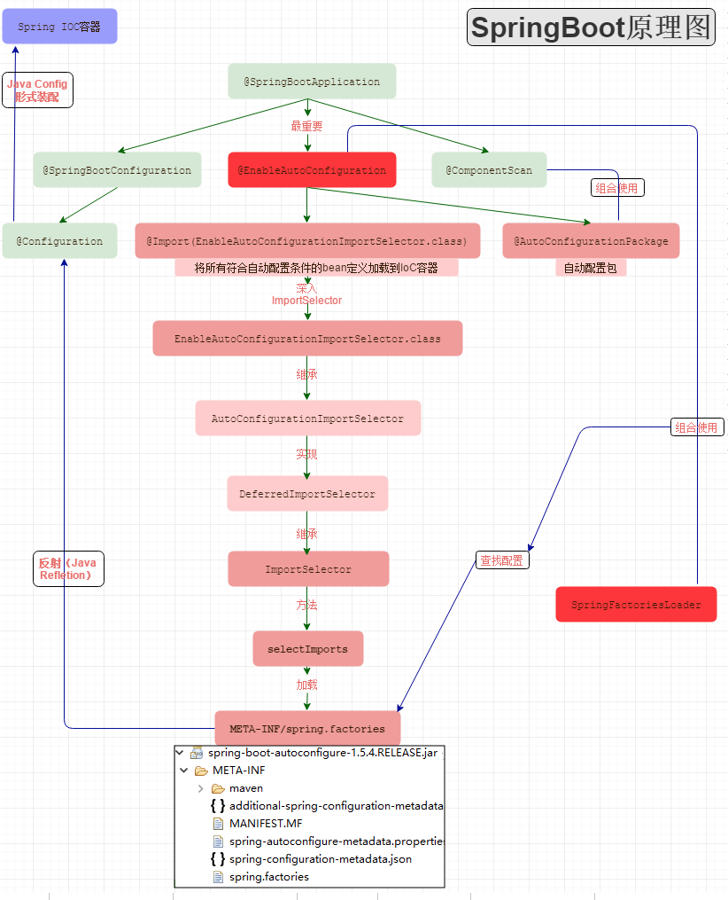
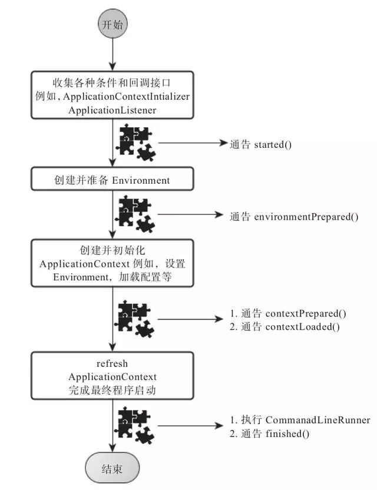

## Spring Boot运行原理

### 一、springboot启动原理及相关流程概览：

springboot是基于spring的新型的轻量级框架，最厉害的地方当属**自动配置。**那我们就可以根据启动流程和相关原理来看看，如何实现传奇的自动配置




### 二、springboot的启动类入口

　　用过springboot的技术人员很显而易见的两者之间的差别就是视觉上很直观的：springboot有自己独立的启动类（独立程序）

```java
@SpringBootApplication
public class Application {
    public static void main(String[] args) {
        SpringApplication.run(Application.class, args);
    }
}
```

从上面代码可以看出，Annotation定义（@SpringBootApplication）和类定义（SpringApplication.run）最为耀眼，所以要揭开SpringBoot的神秘面纱，我们要从这两位开始就可以了。


### 三、单单是SpringBootApplication接口用到了这些注解

```java
@Target(ElementType.TYPE) // 注解的适用范围，其中TYPE用于描述类、接口（包括包注解类型）或enum声明
@Retention(RetentionPolicy.RUNTIME) // 注解的生命周期，保留到class文件中（三个生命周期）
@Documented // 表明这个注解应该被javadoc记录
@Inherited // 子类可以继承该注解
@SpringBootConfiguration // 继承了Configuration，表示当前是注解类
@EnableAutoConfiguration // 开启springboot的注解功能，springboot的四大神器之一，其借助@import的帮助
@ComponentScan(excludeFilters = { // 扫描路径设置（具体使用待确认）
@Filter(type = FilterType.CUSTOM, classes = TypeExcludeFilter.class),
@Filter(type = FilterType.CUSTOM, classes = AutoConfigurationExcludeFilter.class) })
public @interface SpringBootApplication {
...
}
```

在其中比较重要的有三个注解，分别是：

1）@SpringBootConfiguration // 继承了Configuration，表示当前是注解类

2）@EnableAutoConfiguration // 开启springboot的注解功能，springboot的四大神器之一，其借助@import的帮助

3）@ComponentScan(excludeFilters = { // 扫描路径设置（具体使用待确认）


接下来对三个注解一一详解，增加对springbootApplication的理解


###### 1）@Configuration注解

按照原来xml配置文件的形式，在springboot中我们大多用配置类来解决配置问题

**配置bean方式的不同：**　

a）xml配置文件的形式配置bean

```xml
<?xml version="1.0" encoding="UTF-8"?>
<beans xmlns="http://www.springframework.org/schema/beans"
xmlns:xsi="http://www.w3.org/2001/XMLSchema-instance"
xsi:schemaLocation="http://www.springframework.org/schema/beans http://www.springframework.org/schema/beans/spring-beans-3.0.xsd"
default-lazy-init="true">
<!--bean定义-->
</beans>
```

b）javaconfiguration的配置形式配置bean

```java
@Configuration
public class MockConfiguration{
    //bean定义
}
```


**注入bean方式的不同**：

a）xml配置文件的形式注入bean

```xml
<bean id="mockService" class="..MockServiceImpl">
...
</bean>
```

b）javaconfiguration的配置形式注入bean

```java
@Configuration
public class MockConfiguration{
    @Bean
    public MockService mockService(){
        return new MockServiceImpl();
    }
}
```

任何一个标注了@Bean的方法，其返回值将作为一个bean定义注册到Spring的IoC容器，方法名将默认成该bean定义的id。


**表达bean之间依赖关系的不同：**

a）xml配置文件的形式表达依赖关系

```xml
<bean id="mockService" class="..MockServiceImpl">
　　<propery name ="dependencyService" ref="dependencyService" />
</bean>
<bean id="dependencyService" class="DependencyServiceImpl"></bean>
```

b）javaconfiguration配置的形式表达依赖关系

```java
@Configuration
public class MockConfiguration{
　　@Bean
　　public MockService mockService(){
    　　return new MockServiceImpl(dependencyService());
　　}
　　@Bean
　　public DependencyService dependencyService(){
    　　return new DependencyServiceImpl();
　　}
}
```

如果一个bean的定义依赖其他bean,则直接调用对应的JavaConfig类中依赖bean的创建方法就可以了。


###### 2） @ComponentScan注解

作用：

1. 对应xml配置中的元素；
2. ComponentScan的功能其实就是自动扫描并加载符合条件的组件（比如@Component和@Repository等）或者bean定义;
3. 将这些bean定义加载到IoC容器中.

我们可以通过basePackages等属性来**细粒度**的定制@ComponentScan自动扫描的范围，如果不指定，则**默认**Spring框架实现会从声明@ComponentScan所在类的package进行扫描。


###### 3) `@EnableAutoConfiguration`

此注解顾名思义是可以自动配置，所以应该是springboot中最为重要的注解。

在spring框架中就提供了各种以@Enable开头的注解，例如： @EnableScheduling、@EnableCaching、@EnableMBeanExport等； @EnableAutoConfiguration的理念和做事方式其实一脉相承简单概括一下就是，借助`@Import`的支持，收集和注册特定场景相关的bean定义。

- @EnableScheduling是通过@Import将Spring调度框架相关的bean定义都加载到IoC容器【定时任务、时间调度任务】
- @EnableMBeanExport是通过@Import将JMX相关的bean定义加载到IoC容器【监控JVM运行时状态】

@EnableAutoConfiguration也是借助@Import的帮助，将所有符合自动配置条件的bean定义加载到IoC容器。

@EnableAutoConfiguration作为一个复合Annotation,其自身定义关键信息如下：

```java
@SuppressWarnings("deprecation")
@Target(ElementType.TYPE)
@Retention(RetentionPolicy.RUNTIME)
@Documented
@Inherited
@AutoConfigurationPackage【重点注解】
@Import(EnableAutoConfigurationImportSelector.class)【重点注解】
public @interface EnableAutoConfiguration {
...
}
```

其中最重要的两个注解已经标注：1、@AutoConfigurationPackage【重点注解】2、@Import(EnableAutoConfigurationImportSelector.class)【重点注解】

当然还有其中比较重要的一个类就是：EnableAutoConfigurationImportSelector.class

**AutoConfigurationPackage注解：**

```java
static class Registrar implements ImportBeanDefinitionRegistrar, DeterminableImports {
 
@Override
public void registerBeanDefinitions(AnnotationMetadata metadata,BeanDefinitionRegistry registry) {
　　　　register(registry, new PackageImport(metadata).getPackageName());
}
```

它其实是注册了一个Bean的定义

new PackageImport(metadata).getPackageName()，它其实返回了当前主程序类的同级以及子级     的包组件



以上图为例，DemoApplication是和demo包同级，但是demo2这个类是DemoApplication的父级，和example包同级

也就是说，DemoApplication启动加载的Bean中，并不会加载demo2，这也就是为什么，我们要把DemoApplication放在项目的最高级中。


**Import(AutoConfigurationImportSelector.class)注解：**


可以从图中看出  AutoConfigurationImportSelector 继承了 DeferredImportSelector 继承了 ImportSelector

ImportSelector有一个方法为：selectImports。

```java
@Override
public String[] selectImports(AnnotationMetadata annotationMetadata) {
    if (!isEnabled(annotationMetadata)) {
      return NO_IMPORTS;
    }
	AutoConfigurationMetadata autoConfigurationMetadata = AutoConfigurationMetadataLoader.loadMetadata(this.beanClassLoader);
	AnnotationAttributes attributes = getAttributes(annotationMetadata);
	List<String> configurations = getCandidateConfigurations(annotationMetadata,attributes);
	configurations = removeDuplicates(configurations);
	Set<String> exclusions = getExclusions(annotationMetadata, attributes);
	checkExcludedClasses(configurations, exclusions);
	configurations.removeAll(exclusions);
	configurations = filter(configurations, autoConfigurationMetadata);
	fireAutoConfigurationImportEvents(configurations, exclusions);
	return StringUtils.toStringArray(configurations);
}
```

可以看到方法中，它其实是去加载  public static final String FACTORIES_RESOURCE_LOCATION = "META-INF/spring.factories";外部文件。这个外部文件，有很多自动配置的类。如下：



其中，最关键的要属@Import(EnableAutoConfigurationImportSelector.class)，借助EnableAutoConfigurationImportSelector，@EnableAutoConfiguration可以帮助SpringBoot应用将所有符合条件的@Configuration配置都加载到当前SpringBoot创建并使用的IoC容器。就像一只“八爪鱼”一样。




##### 自动配置幕后英雄：SpringFactoriesLoader详解

借助于Spring框架原有的一个工具类：SpringFactoriesLoader的支持，@EnableAutoConfiguration可以智能的自动配置功效才得以大功告成！

SpringFactoriesLoader属于Spring框架私有的一种扩展方案，其主要功能就是从指定的配置文件META-INF/spring.factories加载配置。

```java
public abstract class SpringFactoriesLoader {
//...
　　public static <T> List<T> loadFactories(Class<T> factoryClass, ClassLoader classLoader) {
　　　　...
　　}
  
  
　　public static List<String> loadFactoryNames(Class<?> factoryClass, ClassLoader classLoader) {
　　　　....
　　}
}
```

配合@EnableAutoConfiguration使用的话，它更多是提供一种配置查找的功能支持，即根据@EnableAutoConfiguration的完整类名org.springframework.boot.autoconfigure.EnableAutoConfiguration作为查找的Key,获取对应的一组@Configuration类




上图就是从SpringBoot的autoconfigure依赖包中的META-INF/spring.factories配置文件中摘录的一段内容，可以很好地说明问题。

所以，@EnableAutoConfiguration自动配置的魔法骑士就变成了：从classpath中搜寻所有的META-INF/spring.factories配置文件，并将其中org.springframework.boot.autoconfigure.EnableutoConfiguration对应的配置项通过反射（Java Refletion）实例化为对应的标注了@Configuration的JavaConfig形式的IoC容器配置类，然后汇总为一个并加载到IoC容器。


### 四、springboot启动流程概览图




## 深入探索SpringApplication执行流程

SpringApplication的run方法的实现是我们本次旅程的主要线路，该方法的主要流程大体可以归纳如下：

1） 如果我们使用的是SpringApplication的静态run方法，那么，这个方法里面首先要创建一个SpringApplication对象实例，然后调用这个创建好的SpringApplication的实例方法。在SpringApplication实例初始化的时候，它会提前做几件事情：

```java
public static ConfigurableApplicationContext run(Object[] sources, String[] args) {
    return new SpringApplication(sources).run(args);
}
```

- 根据classpath里面是否存在某个特征类（org.springframework.web.context.ConfigurableWebApplicationContext）来决定是否应该创建一个为Web应用使用的ApplicationContext类型。
- 使用SpringFactoriesLoader在应用的classpath中查找并加载所有可用的ApplicationContextInitializer。
- 使用SpringFactoriesLoader在应用的classpath中查找并加载所有可用的ApplicationListener。
- 推断并设置main方法的定义类。

```java
@SuppressWarnings({ "unchecked", "rawtypes" })
private void initialize(Object[] sources) {
    if (sources != null && sources.length > 0) {
    	this.sources.addAll(Arrays.asList(sources));
	}
    this.webEnvironment = deduceWebEnvironment();
    setInitializers((Collection) getSpringFactoriesInstances(
    ApplicationContextInitializer.class));
    setListeners((Collection) getSpringFactoriesInstances(ApplicationListener.class));
    this.mainApplicationClass = deduceMainApplicationClass();
}
```

2） SpringApplication实例初始化完成并且完成设置后，就开始执行run方法的逻辑了，方法执行伊始，首先遍历执行所有通过SpringFactoriesLoader可以查找到并加载的SpringApplicationRunListener。调用它们的started()方法，告诉这些SpringApplicationRunListener，“嘿，SpringBoot应用要开始执行咯！”。

```java
public ConfigurableApplicationContext run(String... args) {
    StopWatch stopWatch = new StopWatch();
    stopWatch.start();
    ConfigurableApplicationContext context = null;
    FailureAnalyzers analyzers = null;
    configureHeadlessProperty();
    SpringApplicationRunListeners listeners = getRunListeners(args);
    listeners.starting();
    try {
        ApplicationArguments applicationArguments = new DefaultApplicationArguments(
                args);
        ConfigurableEnvironment environment = prepareEnvironment(listeners,
                applicationArguments);
        Banner printedBanner = printBanner(environment);
        context = createApplicationContext();
        analyzers = new FailureAnalyzers(context);
        prepareContext(context, environment, listeners, applicationArguments,
                printedBanner);
　　　　　// 核心点：会打印springboot的启动标志，直到server.port端口启动
        refreshContext(context);
        afterRefresh(context, applicationArguments);
        listeners.finished(context, null);
        stopWatch.stop();
        if (this.logStartupInfo) {
            new StartupInfoLogger(this.mainApplicationClass)
                    .logStarted(getApplicationLog(), stopWatch);
        }
        return context;
    }
    catch (Throwable ex) {
        handleRunFailure(context, listeners, analyzers, ex);
        throw new IllegalStateException(ex);
    }
}
```

3） 创建并配置当前Spring Boot应用将要使用的Environment（包括配置要使用的PropertySource以及Profile）。

```java 
private ConfigurableEnvironment prepareEnvironment(SpringApplicationRunListeners listeners,ApplicationArguments applicationArguments) {
　　// Create and configure the environment
　　ConfigurableEnvironment environment = getOrCreateEnvironment();
　　configureEnvironment(environment, applicationArguments.getSourceArgs());
　　listeners.environmentPrepared(environment);
　　if (!this.webEnvironment) {
　　　　environment = new EnvironmentConverter(getClassLoader()).convertToStandardEnvironmentIfNecessary(environment);
　　}
　　return environment;
}
```

4） 遍历调用所有SpringApplicationRunListener的environmentPrepared()的方法，告诉他们：“当前SpringBoot应用使用的Environment准备好了咯！”。

```java
public void environmentPrepared(ConfigurableEnvironment environment) {
　　for (SpringApplicationRunListener listener : this.listeners) {
　　　　listener.environmentPrepared(environment);
　　}
}
```

5） 如果SpringApplication的showBanner属性被设置为true，则打印banner。

```java
private Banner printBanner(ConfigurableEnvironment environment) {
　　if (this.bannerMode == Banner.Mode.OFF) {
　　　　return null;
　　}
　　ResourceLoader resourceLoader = this.resourceLoader != null ? this.resourceLoader: new DefaultResourceLoader(getClassLoader());
　　SpringApplicationBannerPrinter bannerPrinter = new SpringApplicationBannerPrinter(resourceLoader, this.banner);
　　if (this.bannerMode == Mode.LOG) {
　　　　return bannerPrinter.print(environment, this.mainApplicationClass, logger);
　　}
　　return bannerPrinter.print(environment, this.mainApplicationClass, System.out);
}
```

6） 根据用户是否明确设置了applicationContextClass类型以及初始化阶段的推断结果，决定该为当前SpringBoot应用创建什么类型的ApplicationContext并创建完成，然后根据条件决定是否添加ShutdownHook，决定是否使用自定义的BeanNameGenerator，决定是否使用自定义的ResourceLoader，当然，最重要的，将之前准备好的Environment设置给创建好的ApplicationContext使用。

7） ApplicationContext创建好之后，SpringApplication会再次借助Spring-FactoriesLoader，查找并加载classpath中所有可用的ApplicationContext-Initializer，然后遍历调用这些ApplicationContextInitializer的initialize（applicationContext）方法来对已经创建好的ApplicationContext进行进一步的处理。

```java
@SuppressWarnings({ "rawtypes", "unchecked" })
protected void applyInitializers(ConfigurableApplicationContext context) {
　　for (ApplicationContextInitializer initializer : getInitializers()) {
　　　　Class<?> requiredType = GenericTypeResolver.resolveTypeArgument(initializer.getClass(), ApplicationContextInitializer.class);
　　　　Assert.isInstanceOf(requiredType, context, "Unable to call initializer.");
　　　　initializer.initialize(context);
　　}
}
```

8） 遍历调用所有SpringApplicationRunListener的contextPrepared()方法。

```java
private void prepareContext(ConfigurableApplicationContext context,ConfigurableEnvironment environment, SpringApplicationRunListeners listeners,<br>ApplicationArguments applicationArguments, Banner printedBanner) {
　　context.setEnvironment(environment);
　　postProcessApplicationContext(context);
　　applyInitializers(context);
　　listeners.contextPrepared(context);
　　if (this.logStartupInfo) {
　　　　logStartupInfo(context.getParent() == null);
　　　　logStartupProfileInfo(context);
　　}
// Add boot specific singleton beans
　　context.getBeanFactory().registerSingleton("springApplicationArguments",applicationArguments);
　　if (printedBanner != null) {
　　　　context.getBeanFactory().registerSingleton("springBootBanner", printedBanner);
　　}
// Load the sources
　　Set<Object> sources = getSources();
　　Assert.notEmpty(sources, "Sources must not be empty");
　　load(context, sources.toArray(new Object[sources.size()]));
　　listeners.contextLoaded(context);
}
```

9)最核心的一步，将之前通过@EnableAutoConfiguration获取的所有配置以及其他形式的IoC容器配置加载到已经准备完毕的ApplicationContext。

 ```java
private void prepareAnalyzer(ConfigurableApplicationContext context,FailureAnalyzer analyzer) {
　　if (analyzer instanceof BeanFactoryAware) {
　　　　((BeanFactoryAware) analyzer).setBeanFactory(context.getBeanFactory());
　　}
}
 ```

10） 遍历调用所有SpringApplicationRunListener的contextLoaded()方法。

```java
public void contextLoaded(ConfigurableApplicationContext context) {
　　for (SpringApplicationRunListener listener : this.listeners) {
　　　　listener.contextLoaded(context);
　　}
}
```

11) 调用ApplicationContext的refresh()方法，完成IoC容器可用的最后一道工序。

```java
private void refreshContext(ConfigurableApplicationContext context) {
　　refresh(context);
　　if (this.registerShutdownHook) {
　　try {
　　　　context.registerShutdownHook();
　　}catch (AccessControlException ex) {
　　　　// Not allowed in some environments.
　　}
　　}
}
```

12） 查找当前ApplicationContext中是否注册有CommandLineRunner，如果有，则遍历执行它们。

```java
private void callRunners(ApplicationContext context, ApplicationArguments args) {
　　List<Object> runners = new ArrayList<Object>();
　　runners.addAll(context.getBeansOfType(ApplicationRunner.class).values());
　　runners.addAll(context.getBeansOfType(CommandLineRunner.class).values());
　　AnnotationAwareOrderComparator.sort(runners);
　　for (Object runner : new LinkedHashSet<Object>(runners)) {
　　　　if (runner instanceof ApplicationRunner) {
　　　　　　callRunner((ApplicationRunner) runner, args);
　　　　}
　　　　if (runner instanceof CommandLineRunner) {
　　　　　　callRunner((CommandLineRunner) runner, args);
　　　　}
　　}
}
```

13）正常情况下，遍历执行SpringApplicationRunListener的finished()方法、（如果整个过程出现异常，则依然调用所有SpringApplicationRunListener的finished()方法，只不过这种情况下会将异常信息一并传入处理）

去除事件通知点后，整个流程如下：

```java
public void finished(ConfigurableApplicationContext context, Throwable exception) {
　　for (SpringApplicationRunListener listener : this.listeners) {
　　　callFinishedListener(listener, context, exception);
　　}
}
```




###### 总结

到此，SpringBoot的核心组件完成了基本的解析，综合来看，大部分都是Spring框架背后的一些概念和实践方式，SpringBoot只是在这些概念和实践上对特定的场景事先进行了固化和升华，而也恰恰是这些固化让我们开发基于Sping框架的应用更加方便高效。