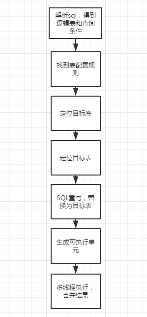

### 前言
最近在项目中，实现需求时候，发现做有些表的数据量预计会很大，由于关系型数据库大多采用B+树类型的索引，在数据量超过阈值的情况下，索引深度的增加也将使得磁盘访问的IO次数增加，进而导致查询性能的下降，同时，高并发访问请求也使得集中式数据库成为系统的最大瓶颈。因此，借助了一些分库分表的中间件，来实现自动化分库分表的实现，这里采用Sharding JDBC 来实现数据分片。


### 介绍

sharding-jdbc 是一款轻量级 Java 框架，以 jar 包形式提供服务，是属于客户端产品不需要额外部署，它相当于是个增强版的 JDBC 驱动；相比之下像 Mycat 这类需要单独的部署服务的服务端产品，就稍显复杂了。

* sharding-jdbc的兼容性也非常强大，适用于任何基于 JDBC 的 ORM 框架，如：JPA， Hibernate，Mybatis，Spring JDBC Template 或直接使用的 JDBC。
* 完美兼容任何第三方的数据库连接池，如：DBCP， C3P0， BoneCP，Druid， HikariCP 等，几乎对所有关系型数据库都支持。

不难发现确实是比较强大的一款工具，而且它对项目的侵入性很小，几乎不用做任何代码层的修改，也无需修改 SQL 语句，只需配置待分库分表的数据表即可。


### 核心概念

在使用Sharding-JDBC之前，下面有一些需要理解的几个核心概念

###### 逻辑表

水平拆分的数据库（表）的相同逻辑和数据结构表的总称。例：订单数据根据主键尾数拆分为10张表，分别是t_order_0到t_order_9，他们的逻辑表名为t_order。

###### 真实表

在分片的数据库中真实存在的物理表。即上个示例中的t_order_0到t_order_9。

###### 数据节点

数据分片的最小单元。由数据源名称和数据表组成，例：ds_0.t_order_0。

#### 数据分片

###### 分片键

用于分片的数据库字段，是将数据库(表)水平拆分的关键字段。例：将订单表中的订单主键的尾数取模分片，则订单主键为分片字段。SQL 中如果无分片字段，将执行全路由，性能较差。除了对单分片字段的支持，Sharding-JDBC 也支持根据多个字段进行分片。

##### 分片算法

通过分片算法将数据分片，支持通过=、>=、<=、>、<、BETWEEN和IN分片。分片算法需要应用方开发者自行实现，可实现的灵活度非常高。

目前提供4种分片算法。由于分片算法和业务实现紧密相关，因此并未提供内置分片算法，而是通过分片策略将各种场景提炼出来，提供更高层级的抽象，并提供接口让应用开发者自行实现分片算法。

###### 精确分片算法

对应 PreciseShardingAlgorithm，用于处理使用单一键作为分片键的 = 与 IN 进行分片的场景。需要配合 StandardShardingStrategy 使用。

###### 范围分片算法

对应 RangeShardingAlgorithm，用于处理使用单一键作为分片键的 BETWEEN AND、>、<、>=、<=进行分片的场景。需要配合 StandardShardingStrategy 使用

###### 复合分片算法

对应 ComplexKeysShardingAlgorithm，用于处理使用多键作为分片键进行分片的场景，包含多个分片键的逻辑较复杂，需要应用开发者自行处理其中的复杂度。需要配合 ComplexShardingStrategy 使用。

###### Hint分片算法

对应 HintShardingAlgorithm，用于处理通过Hint指定分片值而非从SQL中提取分片值的场景。需要配合 HintShardingStrategy 使用。


##### 分片策略

Sharding-JDBC支持以下几种分片策略：不管理分库还是分表，策略基本一样。

* 标准分片策略：对应StandardShardingStrategy。提供对SQL语句中的=, IN和
  BETWEEN AND的分片操作支持。
StandardShardingStrategy只支持单分片键，提供PreciseShardingAlgorithm和RangeShardingAlgorithm两个分片算法。PreciseShardingAlgorithm是必选的，用于处理=和IN的分片。
RangeShardingAlgorithm是可选的，用于处理BETWEEN AND分片，如果不配置RangeShardingAlgorithm，SQL中的BETWEEN AND将按照全库路由处理。

- 复合分片策略：对应ComplexShardingStrategy。复合分片策略。提供对SQL语句中
  的=, IN 和 BETWEEN AND的分片操作支持。
  ComplexShardingStrategy支持多分片键，由于多分片键之间的关系复杂，因此并未进行过多的封装，而是直接将分片键值组合以及分片操作符透传至分片算法，完全由应用开发者实现，提供最大的灵活度。
- 行表达式分片策略：对应InlineShardingStrategy。使用Groovy的表达式，提供对SQL
  语句中的=和IN的分片操作支持，只支持单分片键。
  对于简单的分片算法，可以通过简单的配置使用，从而避免繁琐的Java代码开发，如: t_order_$->{u_id % 8} 表示t_order表根据u_id模8，而分成8张表，表名称为t_order_0 到t_order_7 。
- Hint分片策略：对应HintShardingStrategy。通过Hint而非SQL解析的方式分片的策略。
  对于分片字段非SQL决定，而由其他外置条件决定的场景，可使用SQL Hint灵活的注入分片字段。例：内部系统，按照员工登录主键分库，而数据库中并无此字段。SQL Hint支持通过Java API和SQL注释(待实现)两种方式使用。
- 不分片策略：对应 NoneShardingStrategy。不分片的策略。

##### 理解
上面的切分算法，常用的大体分两种：**取模算法** 和 **范围限定算法**
1、取模算法
按字段取模（对hash结果取余数 (hash() mod N)，N为数据库实例数或子表数量）是最为常见的一种切分方式。

还拿 order 订单表举例，先对数据库从 0 到 N-1进行编号，对 order 订单表中 work_no 订单编号字段进行取模，得到余数 i，i=0存第一个库，i=1存第二个库，i=2存第三个库....以此类推。

这样同一笔订单的数据都会存在同一个库、表里，查询时用相同的规则，用 work_no 订单编号作为查询条件，就能快速的定位到数据。

优点：

* 数据分片相对比较均匀，不易出现请求都打到一个库上的情况。
缺点：

* 这种算法存在一些问题，当某一台机器宕机，本应该落在该数据库的请求就无法得到正确的处理，这时宕掉的实例会被踢出集群，此时算法变成hash(userId) mod N-1，用户信息可能就不再在同一个库中了。

2、范围限定算法
按照 时间区间 或 ID区间 来切分，比如：我们切分的是用户表，可以定义每个库的 User 表里只存10000条数据，第一个库只存 userId 从1 ~ 9999的数据，第二个库存 userId 为10000 ~ 20000，第三个库存 userId 为 20001~ 30000......以此类推，按时间范围也是同理。

优点：

* 单表数据量是可控的
* 水平扩展简单只需增加节点即可，无需对其他分片的数据进行迁移
* 能快速定位要查询的数据在哪个库

缺点：

* 由于连续分片可能存在数据热点，比如按时间字段分片，可能某一段时间内订单骤增，可能会被频繁的读写，而有些分片存储的历史数据，则很少被查询。

### 数据分片示例

###### 数据库脚本

```sql
CREATE TABLE `miniprogram_subscribe_relation` (
  `id` varchar(32) NOT NULL COMMENT '主键id',
  `customer_id` varchar(32) DEFAULT NULL COMMENT '用户id',
  `template_id` varchar(50) DEFAULT NULL COMMENT '消息订阅模板id',
  `subscribe_status` tinyint(4) NOT NULL DEFAULT '0' COMMENT '订阅状态,0:已订阅，1:未订阅',
  `order_id` varchar(32) DEFAULT NULL COMMENT '关联订单id',
  `create_person` varchar(32) DEFAULT NULL COMMENT '创建人',
  `create_time` datetime DEFAULT NULL COMMENT '创建时间',
  `update_person` varchar(32) DEFAULT NULL COMMENT '修改人',
  `update_time` datetime DEFAULT NULL COMMENT '修改时间',
  `del_flag` tinyint(4) NOT NULL DEFAULT '0' COMMENT '删除标识,0:未删除，1:已删除',
  PRIMARY KEY (`id`) USING BTREE,
  KEY `idx_subscribe_status` (`subscribe_status`),
  KEY `idx_del_flag` (`del_flag`)
) ENGINE=InnoDB DEFAULT CHARSET=utf8mb4 COMMENT='小程序用户关联消息订阅模板关系表';
```
###### 基于Spring Boot配置
```properties
spring.shardingsphere.datasource.names=master,slave0
spring.shardingsphere.datasource.master.driver-class-name=com.mysql.cj.jdbc.Driver
spring.shardingsphere.datasource.master.url=jdbc:mysql://172.19.25.60:3306/sbc-marketing?characterEncoding=UTF-8&serverTimezone=Asia/Shanghai&allowMultiQueries=true
spring.shardingsphere.datasource.master.username=root
spring.shardingsphere.datasource.master.password=Wmi@2019
spring.shardingsphere.datasource.master.type=com.alibaba.druid.pool.DruidDataSource
 
spring.shardingsphere.datasource.slave0.driver-class-name=com.mysql.cj.jdbc.Driver
spring.shardingsphere.datasource.slave0.url=jdbc:mysql://172.19.25.60:3306/sbc-marketing?characterEncoding=UTF-8&serverTimezone=Asia/Shanghai&allowMultiQueries=true
spring.shardingsphere.datasource.slave0.username=root
spring.shardingsphere.datasource.slave0.password=Wmi@2019
spring.shardingsphere.datasource.slave0.type=com.alibaba.druid.pool.DruidDataSource

# 分片策略
spring.shardingsphere.sharding.tables.miniprogram_subscribe_relation.actual-data-nodes=ds0.miniprogram_subscribe_relation_$->{0..9}
# 分片键（字段）
spring.shardingsphere.sharding.tables.miniprogram_subscribe_relation.table-strategy.standard.sharding-column=customer_id
# 精确分片算法
spring.shardingsphere.sharding.tables.miniprogram_subscribe_relation.table-strategy.standard.precise-algorithm-class-name=com.wanmi.sbc.message.algorithm.MiniprogramSubscribeRelationShardingAlgorithm

# 逻辑表
spring.shardingsphere.sharding.binding-tables=miniprogram_subscribe_relation
```

###### 精确分片算法实现
```java
/**
 * @author
 * 小程序消息订阅-用户关联模板关系表-分表规则
 * PreciseShardingAlgorithm:精确分片算法，用于=、in场景
 */
@Slf4j
public class MiniprogramSubscribeRelationShardingAlgorithm implements PreciseShardingAlgorithm<String> {

    @Override
    public String doSharding(Collection<String> availableTargetNames, PreciseShardingValue<String> preciseShardingValue) {
        log.info("=======小程序用户关联模板关系分表开始=========");
        String logicTableName= preciseShardingValue.getLogicTableName();
        int value = Math.abs(preciseShardingValue.getValue().hashCode() % availableTargetNames.size());
        log.info("=======小程序用户关联模板关系分表结束，最终路由表名：{}=========",logicTableName  + "_" + value);
        return logicTableName  + "_" + value;
    }
}
```
###### 执行流程
Sharding-JDBC 的原理总结起来很简单: 




#### 总结
针对 miniprogram_subscribe_relation 表，使用了 customer_id 作为分片键，hash值取模分片规则处理，总体就完成了。
还有就是Sharing-JDBC对mysql的全文索引支持的不是很好，项目有使用到的地方也要注意一下。总结来说整个过程还是比较简单的，后续碰到其它业务场景，相信大家按照这个思路肯定都能解决的。

参考：[官网](http://shardingsphere.apache.org/index_zh.html)