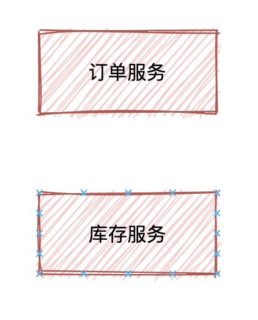
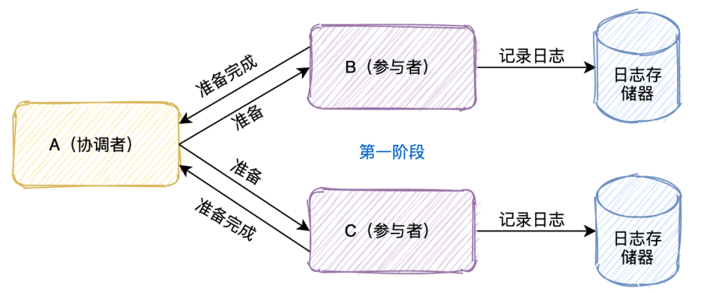

# 什么是分布式事务

分布式事务是指事务的参与者、支持事务的服务器、资源服务器以及事务管理器**「分别位于不同的分布式系统的不同节点之上」**。

一个大的操作由N多的小的操作共同完成。而这些小的操作又分布在不同的服务上。针对于这些操作，**「要么全部成功执行，要么全部不执行」**。

# 为什么会有分布式事务？

举个例子：

转账是最经典的分布式事务场景，假设用户 A 使用银行 app 发起一笔跨行转账给用户 B，银行系统首先扣掉用户 A 的钱，然后增加用户 B 账户中的余额。

如果其中某个步骤失败，此时就有可能会出现 2 种**「异常」**情况：

- 1.用户 A 的账户扣款成功，用户 B 账户余额增加失败
- 2.用户 A 账户扣款失败，用户 B 账户余额增加成功。

对于银行系统来说，以上 2 种情况都是**「不允许发生」**，此时就需要事务来保证转账操作的成功。

在**「单体应用」**中，我们只需要贴上@Transactional注解就可以开启事务来保证整个操作的**「原子性」**。

但是看似以上简单的操作，在实际的应用架构中，不可能是单体的服务，我们会把这一系列操作交给**「N个服务」**去完成，也就是拆分成为**「分布式微服务架构」**。

比如下订单服务，扣库存服务等等，必须要**「保证不同服务状态结果的一致性」**，于是就出现了分布式事务。

# 分布式理论

## CAP定理

在一个分布式系统中，以下三点特性无法同时满足，**「鱼与熊掌不可兼得」**

> 一致性（C）：
> 在分布式系统中的所有数据备份，**「在同一时刻是否拥有同样的值」**。（等同于所有节点访问同一份最新的数据副本）

> 可用性（A）：
> 在集群中一部分节点**「故障」**后，集群整体**「是否还能响应」**客户端的读写请求。（对数据更新具备高可用性）

> 分区容错性（P）：
> 即使出现**「单个组件无法可用,操作依然可以完成」**。

具体地讲在分布式系统中，在任何数据库设计中，一个Web应用**「至多只能同时支持上面的两个属性」**。显然，任何横向扩展策略都要依赖于数据分区。因此，设计人员必须在一致性与可用性之间做出选择。

## BASE理论

在分布式系统中，我们往往追求的是可用性，它的重要程序比一致性要高，那么如何实现高可用性呢？

前人已经给我们提出来了另外一个理论，就是BASE理论，它是用来对CAP定理进行进一步扩充的。BASE理论指的是：

- **「Basically Available（基本可用）」**
- **「Soft state（软状态）」**
- **「Eventually consistent（最终一致性）」**

BASE理论是对CAP中的一致性和可用性进行一个权衡的结果，理论的核心思想就是：我们无法做到强一致，但每个应用都可以根据自身的业务特点，采用适当的方式来使系统达到最终一致性（Eventual consistency）。

# 分布式事务解决方案

## 两阶段提交（2PC）

熟悉mysql的同学对两阶段提交应该颇为熟悉，mysql的事务就是通过**「日志系统」**来完成两阶段提交的。

两阶段协议可以用于单机集中式系统，由事务管理器协调多个资源管理器；也可以用于分布式系统，**「由一个全局的事务管理器协调各个子系统的局部事务管理器完成两阶段提交」**。

这个协议有**「两个角色」**，

A节点是事务的协调者，B和C是事务的参与者。

事务的提交分成两个阶段

第一个阶段是**「投票阶段」**

- 1.协调者首先将命令**「写入日志」**
- 2. **「发一个prepare命令」**给B和C节点这两个参与者
- 3.B和C收到消息后，根据自己的实际情况，**「判断自己的实际情况是否可以提交」**
- 4.将处理结果**「记录到日志」**系统
- 5.将结果**「返回」**给协调者

第二个阶段是**「决定阶段」**

当A节点收到B和C参与者所有的确认消息后

- **「判断」**所有协调者**「是否都可以提交」**

- - 如果可以则**「写入日志」**并且发起commit命令
  - 有一个不可以则**「写入日志」**并且发起abort命令

- 参与者收到协调者发起的命令，**「执行命令」**

- 将执行命令及结果**「写入日志」**

- **「返回结果」**给协调者

#### 可能会存在哪些问题？

- **「单点故障」**：一旦事务管理器出现故障，整个系统不可用
- **「数据不一致」**：在阶段二，如果事务管理器只发送了部分 commit 消息，此时网络发生异常，那么只有部分参与者接收到 commit 消息，也就是说只有部分参与者提交了事务，使得系统数据不一致。
- **「响应时间较长」**：整个消息链路是串行的，要等待响应结果，不适合高并发的场景
- **「不确定性」**：当事务管理器发送 commit 之后，并且此时只有一个参与者收到了 commit，那么当该参与者与事务管理器同时宕机之后，重新选举的事务管理器无法确定该条消息是否提交成功。

## 三阶段提交（3PC）

三阶段提交又称3PC，相对于2PC来说增加了CanCommit阶段和超时机制。如果段时间内没有收到协调者的commit请求，那么就会自动进行commit，解决了2PC单点故障的问题。

但是性能问题和不一致问题仍然没有根本解决。下面我们还是一起看下三阶段流程的是什么样的？

- 第一阶段：**「CanCommit阶段」**这个阶段所做的事很简单，就是协调者询问事务参与者，你是否有能力完成此次事务。

- - 如果都返回yes，则进入第二阶段
  - 有一个返回no或等待响应超时，则中断事务，并向所有参与者发送abort请求

- 第二阶段：**「PreCommit阶段」**此时协调者会向所有的参与者发送PreCommit请求，参与者收到后开始执行事务操作，并将Undo和Redo信息记录到事务日志中。参与者执行完事务操作后（此时属于未提交事务的状态），就会向协调者反馈“Ack”表示我已经准备好提交了，并等待协调者的下一步指令。

- 第三阶段：**「DoCommit阶段」**在阶段二中如果所有的参与者节点都可以进行PreCommit提交，那么协调者就会从“预提交状态”转变为“提交状态”。然后向所有的参与者节点发送"doCommit"请求，参与者节点在收到提交请求后就会各自执行事务提交操作，并向协调者节点反馈“Ack”消息，协调者收到所有参与者的Ack消息后完成事务。相反，如果有一个参与者节点未完成PreCommit的反馈或者反馈超时，那么协调者都会向所有的参与者节点发送abort请求，从而中断事务。

## 补偿事务（TCC）

TCC其实就是采用的补偿机制，其核心思想是：**「针对每个操作，都要注册一个与其对应的确认和补偿（撤销）操作」**。它分为三个阶段：

**「Try,Confirm,Cancel」**

- Try阶段主要是对**「业务系统做检测及资源预留」**，其主要分为两个阶段

- - Confirm 阶段主要是对**「业务系统做确认提交」**，Try阶段执行成功并开始执行 Confirm阶段时，默认 Confirm阶段是不会出错的。即：只要Try成功，Confirm一定成功。
  - Cancel 阶段主要是在业务执行错误，需要回滚的状态下执行的业务取消，**「预留资源释放」**。

比如下一个订单减一个库存：

执行流程：

- Try阶段：订单系统将当前订单状态设置为支付中，库存系统校验当前剩余库存数量是否大于1，然后将可用库存数量设置为库存剩余数量-1，

- - 如果Try阶段**「执行成功」**，执行Confirm阶段，将订单状态修改为支付成功，库存剩余数量修改为可用库存数量
  - 如果Try阶段**「执行失败」**，执行Cancel阶段，将订单状态修改为支付失败，可用库存数量修改为库存剩余数量

TCC 事务机制相比于上面介绍的2PC，解决了其几个缺点：

- 1.**「解决了协调者单点」**，由主业务方发起并完成这个业务活动。业务活动管理器也变成多点，引入集群。
- 2.**「同步阻塞」**：引入超时，超时后进行补偿，并且不会锁定整个资源，将资源转换为业务逻辑形式，粒度变小。
- 3.**「数据一致性」**，有了补偿机制之后，由业务活动管理器控制一致性

总之，TCC 就是通过代码人为实现了两阶段提交，不同的业务场景所写的代码都不一样，并且很大程度的**「增加」**了业务代码的**「复杂度」**，因此，这种模式并不能很好地被复用。

## 本地消息表

执行流程：

- 消息生产方，需要额外建一个消息表，并**「记录消息发送状态」**。消息表和业务数据要在一个事务里提交，也就是说他们要在一个数据库里面。然后消息会经过MQ发送到消息的消费方。

- - 如果消息发送失败，会进行重试发送。

- 消息消费方，需要**「处理」**这个**「消息」**，并完成自己的业务逻辑。

- - 如果是**「业务上面的失败」**，可以给生产方**「发送一个业务补偿消息」**，通知生产方进行回滚等操作。

- - 此时如果本地事务处理成功，表明已经处理成功了
  - 如果处理失败，那么就会重试执行。

- 生产方和消费方定时扫描本地消息表，把还没处理完成的消息或者失败的消息再发送一遍。

## 消息事务

消息事务的原理是将两个事务**「通过消息中间件进行异步解耦」**，和上述的本地消息表有点类似，但是是通过消息中间件的机制去做的，其本质就是'将本地消息表封装到了消息中间件中'。

执行流程：

- 发送prepare消息到消息中间件

- 发送成功后，执行本地事务

- - 如果事务执行成功，则commit，消息中间件将消息下发至消费端
  - 如果事务执行失败，则回滚，消息中间件将这条prepare消息删除

- 消费端接收到消息进行消费，如果消费失败，则不断重试

这种方案也是实现了**「最终一致性」**，对比本地消息表实现方案，不需要再建消息表，**「不再依赖本地数据库事务」**了，所以这种方案更适用于高并发的场景。目前市面上实现该方案的**「只有阿里的 RocketMQ」**。

## 最大努力通知

最大努力通知的方案实现比较简单，适用于一些最终一致性要求较低的业务。

执行流程：

- 系统 A 本地事务执行完之后，发送个消息到 MQ；
- 这里会有个专门消费 MQ 的服务，这个服务会消费 MQ 并调用系统 B 的接口；
- 要是系统 B 执行成功就 ok 了；要是系统 B 执行失败了，那么最大努力通知服务就定时尝试重新调用系统 B, 反复 N 次，最后还是不行就放弃。

## Sagas 事务模型

Saga事务模型又叫做长时间运行的事务

其核心思想是**「将长事务拆分为多个本地短事务」**，由Saga事务协调器协调，如果正常结束那就正常完成，如果**「某个步骤失败，则根据相反顺序一次调用补偿操作」**。

Seata框架中一个分布式事务包含3种角色：

**「Transaction Coordinator (TC)」**：事务协调器，维护全局事务的运行状态，负责协调并驱动全局事务的提交或回滚。**「Transaction Manager (TM)」**：控制全局事务的边界，负责开启一个全局事务，并最终发起全局提交或全局回滚的决议。**「Resource Manager (RM)」**：控制分支事务，负责分支注册、状态汇报，并接收事务协调器的指令，驱动分支（本地）事务的提交和回滚。

seata框架**「为每一个RM维护了一张UNDO_LOG表」**，其中保存了每一次本地事务的回滚数据。

具体流程：1.首先TM 向 TC 申请**「开启一个全局事务」**，全局事务**「创建」**成功并生成一个**「全局唯一的 XID」**。

2.XID 在微服务调用链路的上下文中传播。

3.RM 开始执行这个分支事务，RM首先解析这条SQL语句，**「生成对应的UNDO_LOG记录」**。下面是一条UNDO_LOG中的记录，UNDO_LOG表中记录了分支ID，全局事务ID，以及事务执行的redo和undo数据以供二阶段恢复。

4.RM在同一个本地事务中**「执行业务SQL和UNDO_LOG数据的插入」**。在提交这个本地事务前，RM会向TC**「申请关于这条记录的全局锁」**。

如果申请不到，则说明有其他事务也在对这条记录进行操作，因此它会在一段时间内重试，重试失败则回滚本地事务，并向TC汇报本地事务执行失败。

6.RM在事务提交前，**「申请到了相关记录的全局锁」**，然后直接提交本地事务，并向TC**「汇报本地事务执行成功」**。此时全局锁并没有释放，全局锁的释放取决于二阶段是提交命令还是回滚命令。

7.TC根据所有的分支事务执行结果，向RM**「下发提交或回滚」**命令。

- RM如果**「收到TC的提交命令」**，首先**「立即释放」**相关记录的全局**「锁」**，然后把提交请求放入一个异步任务的队列中，马上返回提交成功的结果给 TC。异步队列中的提交请求真正执行时，只是删除相应 UNDO LOG 记录而已。

- RM如果**「收到TC的回滚命令」**，则会开启一个本地事务，通过 XID 和 Branch ID 查找到相应的 UNDO LOG 记录。将 UNDO LOG 中的后镜与当前数据进行比较，

- - 如果不同，说明数据被当前全局事务之外的动作做了修改。这种情况，需要根据配置策略来做处理。
  - 如果相同，根据 UNDO LOG 中的前镜像和业务 SQL 的相关信息生成并执行回滚的语句并执行，然后提交本地事务达到回滚的目的，最后释放相关记录的全局锁。

**总结**

本文介绍了分布式事务的一些基础理论，并对常用的分布式事务方案进行了讲解。

分布式事务本身就是一个技术难题，业务中具体使用哪种方案还是需要不同的业务特点自行选择，但是我们也会发现，分布式事务会大大的提高流程的复杂度，会带来很多额外的开销工作，**「代码量上去了，业务复杂了，性能下跌了」**。

所以，当我们真实开发的过程中，能不使用分布式事务就不使用。